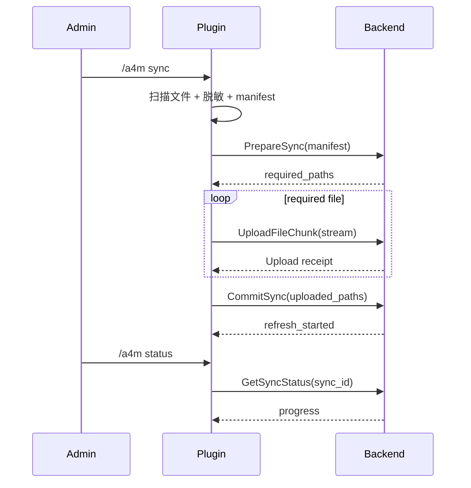

# 配置同步

配置同步用于把 Minecraft 服务端的配置文件上传给后端，让后端构建和刷新服务器配置语义记忆。

## 同步入口

```text
/a4m sync
```

查看状态：

```text
/a4m status
```

## 允许上传的文件

插件不会上传整个服务器目录，只扫描允许范围。

根目录允许：

- `server.properties`
- `bukkit.yml`
- `spigot.yml`
- `paper*.yml`

`plugins/` 下允许扩展名：

- `.yml`
- `.yaml`
- `.json`
- `.properties`
- `.txt`
- `.md`

## 不会上传的内容

- jar 文件。
- 数据库文件。
- 日志文件。
- 世界存档。
- 任意二进制文件。
- 不在允许路径范围内的文件。
- 符号链接指向的文件。

## Manifest

每个文件会生成：

| 字段 | 说明 |
| --- | --- |
| `relative_path` | 相对服务端根目录路径，使用 `/` |
| `size` | 上传内容字节数 |
| `sha256` | 上传内容 SHA-256 |
| `last_modified_epoch_ms` | 本地源文件修改时间 |

注意：如果文件被脱敏，`size` 和 `sha256` 基于脱敏后的上传内容，而不是本地原文件。

## 敏感值脱敏

插件会在上传前尝试识别敏感配置值，并写入临时脱敏副本。

特点：

- 本地配置文件不被修改。
- 只上传脱敏副本。
- 脱敏副本位于插件数据目录的同步缓存中。
- 同步结束或失败后清理临时文件。

## 同步协议



## 后端刷新

后端收到提交后，会把文件保存到：

```text
mc_servers/<server.id>/...
```

然后启动语义刷新，把配置抽取为可检索的服务器配置语义记忆。刷新过程可能比上传更久，因此 `/a4m status` 会继续查询远程状态。

## 常见同步结果

- `requiredUploads=0`：后端已有相同文件，不需要上传。
- `refreshStarted=true`：后端已开始或已有刷新任务。
- `remote state=INDEXING`：后端正在抽取和写入语义记忆。
- `remote state=COMPLETED`：刷新完成。
- `remote state=FAILED`：刷新失败，查看后端日志。
