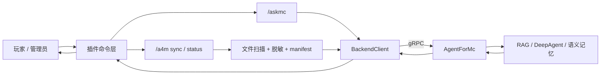

# Agent4Minecraft Wiki

Agent4Minecraft 是 Minecraft 服务端插件端，负责把游戏内玩家和管理员操作桥接到后端 AI 服务 [AgentForMc](https://github.com/EternalmBlue/AgentForMc)。

插件侧只负责 Minecraft 内的入口、上下文收集、文件同步和结果展示。检索、向量数据库、规划执行、语义记忆和大模型调用都由后端完成。

## 仓库关系

| 仓库 | 角色 | 链接 |
| --- | --- | --- |
| Agent4Minecraft | Paper / Spigot 插件，运行在 Minecraft 服务端 | https://github.com/EternalmBlue/Agent4Minecraft |
| AgentForMc | AI 后端，运行 gRPC 服务和 RAG / DeepAgent 逻辑 | https://github.com/EternalmBlue/AgentForMc |

## 核心能力

- `/askmc <问题>`：玩家在游戏内向 AI 后端提问。
- `/a4m sync`：管理员手动同步服务端配置和插件配置。
- `/a4m status`：查看本地同步和远程语义刷新状态。
- gRPC 通信：通过 `AgentBridgeService` 调用后端。
- 启动探测：插件启用时检查后端是否可用、协议是否兼容、`server.id` 是否冲突。
- 文件同步：manifest、SHA-256、增量上传、client-streaming 分块传输。
- 上传前脱敏：只改上传副本，不修改 Minecraft 本地配置。
- 多语言消息：内置 `zh_CN` 和 `en_US`。

## 架构图

## 设计边界

插件应该做：

- 注册命令和权限。
- 收集玩家身份、服务端 ID、已安装插件快照。
- 扫描允许同步的配置文件。
- 计算 manifest 和 SHA-256。
- 上传前脱敏。
- 调用后端 gRPC 接口。
- 把答案、错误、同步状态渲染为游戏内消息。

插件不应该做：

- 不实现 RAG、向量数据库、文档检索。
- 不直接调用大模型。
- 不内置规划、重排、语义记忆逻辑。
- 不阻塞 Minecraft 主线程做网络、扫描、压缩或上传。
- 不硬编码后端地址、token、server.id 或本地绝对路径。

## 推荐阅读顺序

1. [快速开始](Quick-Start)
2. [安装与部署](Install-and-Deploy)
3. [插件配置](Configuration)
4. [后端集成](Backend-Integration)
5. [配置同步](Config-Sync)
6. [故障排查](Troubleshooting)
