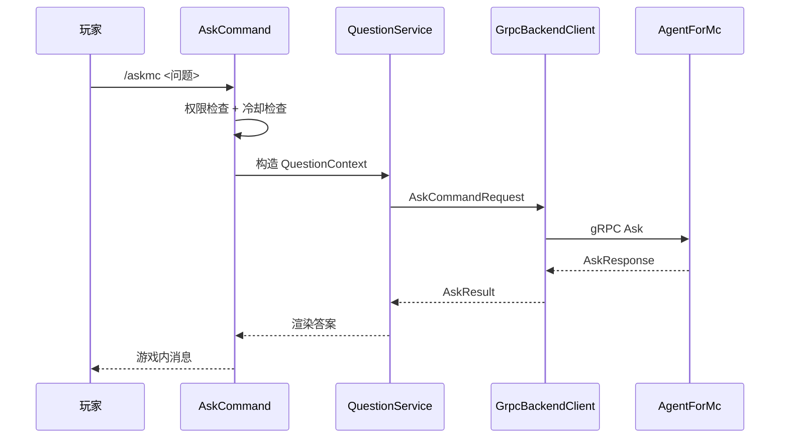

# 问答流程

`/askmc` 是插件侧的主要玩家入口。

## 请求链路

## 插件侧收集的上下文

| 字段 | 来源 | 用途 |
| --- | --- | --- |
| `server_id` | `config.yml` 或服务端根目录名 | 后端区分服务器 |
| `server_instance_id` | `server-instance-id.txt` | 物理实例绑定校验 |
| `player_id` | 玩家 UUID 或控制台 sender | 后端会话和记忆作用域 |
| `player_name` | sender 名称 | 展示和 fallback |
| `question` | 命令参数 | 原始问题 |
| `request_id` | 插件生成 | 追踪单次请求 |
| `timestamp` | 当前时间 | 后端记录请求时间 |
| `installed_plugins` | Paper PluginManager | 后端判断当前服务端插件环境 |

## 限流

默认同一玩家同时只能有一个问答请求进行中，并且有 `qa.rateLimitSeconds` 冷却。

目的：

- 避免玩家刷屏。
- 避免短时间大量后端请求。
- 避免同一玩家上下文交错。

## 错误展示

插件会把后端异常映射为玩家可理解的消息：

- 认证失败：检查 `backend.authToken`。
- 后端不可用：检查后端进程和网络。
- 超时：提示稍后重试。
- 请求被拒绝：展示后端返回的拒绝原因。
- 未知错误：展示兜底失败文案。

## 主线程安全

问答网络请求通过插件线程池执行。回到游戏内发消息时，插件会切回 Bukkit 主线程。

不要在命令执行方法中直接做网络 I/O 或等待后端响应。
