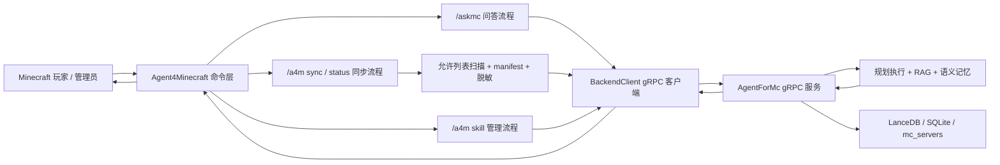

# Agent4Minecraft

Agent4Minecraft 是 AgentForMc 项目的 Minecraft 插件端。它运行在 Paper / Spigot 兼容服务端中，负责接收玩家提问、收集必要的服务端上下文、同步允许上传的配置文件，并通过 gRPC 把请求转发给后端 AI 服务。

本仓库只做插件侧的传输、权限、命令和游戏内展示，不在插件内实现检索、向量数据库、规划执行或大模型推理。

## 关联仓库

| 仓库 | 职责 | 地址                                           |
| --- | --- |----------------------------------------------|
| Agent4Minecraft | Minecraft 插件端，也就是游戏内入口和文件同步客户端 |                                              |
| AgentForMc | AI 后端，负责问答规划、RAG 检索、语义记忆、配置摄取和 gRPC 服务 | <https://github.com/EternalmBlue/AgentForMc> |
| AgentForMc-Reranker | 可选 reranker 中间件，单独承载 BCE 模型和重排 gRPC 服务 | <https://github.com/EternalmBlue/AgentForMc-Reranker> |

插件端和后端通过同一份 gRPC 协议对接：

- 插件端协议文件：`src/main/proto/agent_bridge.proto`
- 后端协议文件：`agent_for_mc/interfaces/grpc/agent_bridge.proto`
- 默认 gRPC 地址：`127.0.0.1:50051`
- 认证方式：所有业务 RPC 都携带 `authorization: Bearer <token>` 元数据

## 功能概览

- 游戏内问答：玩家或管理员使用 `/askmc <问题>` 向后端提问。
- 后端桥接：插件通过 gRPC 调用 AgentForMc 的 `AgentBridgeService`。
- 启动探测：插件启动时执行 `Probe`，检查后端可用性、协议版本和服务端身份绑定。
- 服务端身份：插件维护稳定的 `server-instance-id.txt`，后端用它检测重复 `server.id` 绑定。
- 配置同步：管理员使用 `/a4m sync` 上传允许同步的服务端配置和插件配置。
- 增量上传：插件先发送 manifest，后端只要求上传缺失或变更文件。
- 分块传输：文件上传使用 client-streaming gRPC，避免大文件一次性进入内存。
- 敏感值脱敏：插件上传前会对配置内容做前端侧脱敏，本地原文件不被修改。
- 同步状态：管理员使用 `/a4m status` 查看本地同步进度和后端刷新状态。
- Skill 管理：服主使用 `/a4m skill ...` 查看三层 Skill，并通过私有聊天会话创建、预览、确认安装或删除本服 Skill。
- 多语言消息：内置简体中文和英文消息文件。
- 异步执行：网络、扫描、校验、上传都不阻塞 Minecraft 主线程。

## 整体架构



插件侧模块边界：

| 模块 | 说明 |
| --- | --- |
| `bootstrap` | 插件启动、线程池、启动探测、服务端实例 ID |
| `config` | `config.yml` 读取、默认值和校验 |
| `command` | `/askmc`、`/a4m sync`、`/a4m status`、`/a4m skill ...` |
| `qa` | 问答请求构造、限流、答案渲染 |
| `skill` | Skill 管理请求编排，私有聊天会话只保存当前玩家的 `draft_id` |
| `transfer` | 文件扫描、checksum、脱敏、manifest、上传编排 |
| `backend` | `BackendClient` 抽象和 gRPC 实现 |
| `domain` | 插件侧 DTO 与状态模型 |
| `i18n` | 语言枚举、消息加载和格式化 |
| `src/main/proto` | 插件侧 gRPC 协议源文件 |

## 环境要求

插件端：

- JDK 21 用于本地构建工具链
- Java 17 字节码目标，用于 Paper 1.20.4+ 兼容
- Gradle Wrapper，仓库已内置 `gradlew` / `gradlew.bat`
- Paper 1.20.4+ 或兼容服务端

后端：

- Python 3.11+ 推荐
- AgentForMc 仓库及其 `requirements.txt` 依赖
- DeepSeek API Key
- 智谱 embedding API Key
- 与插件一致的 gRPC Bearer Token

## 快速开始

### 1. 克隆关联仓库

```powershell
git clone https://github.com/EternalmBlue/AgentForMc.git
git clone https://github.com/EternalmBlue/AgentForMc-Reranker.git
```

建议插件端和后端放在同一台机器上先完成本地联调。AgentForMc-Reranker 只有在需要启用 reranker 时才需要运行。默认情况下，插件会连接 `127.0.0.1:50051`。

### 2. 配置并启动后端

进入后端仓库：

```powershell
cd AgentForMc
python -m venv .venv
.\.venv\Scripts\Activate.ps1
pip install -r requirements.txt
Copy-Item .env.example .env
```

编辑 `AgentForMc/.env`：

```dotenv
RAG_ZHIPU_API_KEY=你的智谱APIKey
RAG_LLM_API_KEY=你的LLM APIKey
RAG_GRPC_AUTH_TOKEN=change_me_to_a_strong_token
```

旧部署里的 `RAG_DEEPSEEK_API_KEY` 仍兼容，新部署建议使用 `RAG_LLM_API_KEY`。

启动后端 gRPC 服务：

```powershell
python main.py
```

默认监听地址是 `127.0.0.1:50051`。如果要允许其他机器上的 Minecraft 服务端连接，请在后端 `config.toml` 中配置：

```toml
[grpc]
host = "0.0.0.0"
port = 50051
```

### 3. 构建插件

进入插件仓库：

```powershell
cd Agent4Minecraft
.\gradlew.bat clean test build
```

构建成功后，插件 jar 位于：

```text
build/libs/Agent4Minecraft-<version>.jar
```

`plain` 后缀的 jar 不是最终服务端部署包。请部署不带 `plain` 的 shaded jar。

### 4. 安装到 Minecraft 服务端

1. 停止 Paper 服务端。
2. 将 `build/libs/Agent4Minecraft-<version>.jar` 放入服务端 `plugins/` 目录。
3. 启动一次服务端，让插件生成默认配置。
4. 停止服务端，编辑 `plugins/Agent4Minecraft/config.yml`。
5. 再次启动服务端。

最小配置通常只需要修改 `backend.authToken`：

```yaml
backend:
  authToken: "change_me_to_a_strong_token"
```

这个值必须和后端 `AgentForMc/.env` 中的 `RAG_GRPC_AUTH_TOKEN` 一致。

如果后端不在同一台机器上，再配置 host / port：

```yaml
backend:
  authToken: "change_me_to_a_strong_token"
  host: "10.0.0.12"
  port: 50051
```

## 插件配置说明

默认配置文件在 `src/main/resources/config.yml`，首次启动后会复制到：

```text
plugins/Agent4Minecraft/config.yml
```

常用配置：

| 配置项 | 默认值 | 说明 |
| --- | --- | --- |
| `backend.authToken` | `EternalBlue` | gRPC 认证 token，生产环境必须修改 |
| `backend.host` | `127.0.0.1` | 后端 gRPC 地址 |
| `backend.port` | `50051` | 后端 gRPC 端口 |
| `backend.useTls` | `false` | 后端启用 TLS 时改为 `true` |
| `backend.probeTimeoutMillis` | `3000` | 启动探测超时时间 |
| `backend.askDeadlineMillis` | `120000` | 问答请求 deadline |
| `backend.syncDeadlineMillis` | `15000` | 同步相关 RPC deadline |
| `backend.maxChunkBytes` | `262144` | 文件上传分块大小 |
| `plugin.language` | `zh_CN` | 插件消息语言，支持 `zh_CN` / `en_US` |
| `plugin.debug` | `false` | 是否输出额外调试日志 |
| `qa.rateLimitSeconds` | `3` | 同一玩家问答冷却秒数 |
| `server.id` | 自动从服务端根目录名推导 | 后端识别 Minecraft 服务器的人类可读 ID |

`server.id` 是给运维和后端存储使用的服务器名。插件还会自动生成物理实例 ID：

```text
plugins/Agent4Minecraft/server-instance-id.txt
```

请不要把多个不同 Minecraft 服务端配置成同一个 `server.id`。如果后端提示 `server.id conflict`，说明该 `server.id` 已绑定到另一个服务端实例。

## 游戏内命令

| 命令 | 权限 | 默认权限 | 说明 |
| --- | --- | --- | --- |
| `/askmc <问题>` | `agent4minecraft.ask` | 所有人 | 向后端发起问答 |
| `/a4m sync` | `agent4minecraft.admin` | OP | 扫描并同步允许上传的配置文件 |
| `/a4m status` | `agent4minecraft.admin` | OP | 查询本地和后端同步状态 |
| `/a4m skill list` | `agent4minecraft.admin` | OP | 查看官方、全局、本服三层 Skill |
| `/a4m skill view <name>` | `agent4minecraft.admin` | OP | 查看某个 Skill 的摘要和 `SKILL.md` |
| `/a4m skill create <需求>` | `agent4minecraft.admin` | OP | 进入本服 Skill 多轮创建流程 |
| `/a4m skill confirm` | `agent4minecraft.admin` | OP | 确认安装当前 Skill 草稿 |
| `/a4m skill cancel` | `agent4minecraft.admin` | OP | 取消当前 Skill 草稿 |
| `/a4m skill delete <name>` | `agent4minecraft.admin` | OP | 删除本服 Skill，官方和全局 Skill 只读 |

`/a4m skill create <需求>` 由玩家执行时会进入私有 Skill 创建模式。进入后直接在聊天栏回答后端 LLM 的追问，插件会拦截这些聊天消息并取消广播，其他玩家看不到。草稿就绪后使用 `/a4m skill confirm` 安装并退出私有模式，或使用 `/a4m skill cancel` 放弃草稿。Console 无法进入聊天模式，但仍可继续用 `/a4m skill create <回答>` 的命令式方式补充信息。

示例：

```text
/askmc eco 插件的金币倍率在哪里配置？
/a4m sync
/a4m status
/a4m skill list
/a4m skill create 帮服主回答经济插件配置问题
```

## 配置同步范围

插件不会盲目上传整个服务器目录。当前允许上传的文件范围是：

- `plugins/` 下的文本配置文件
- 根目录下的 `server.properties`
- 根目录下的 `bukkit.yml`
- 根目录下的 `spigot.yml`
- 根目录下匹配 `paper*.yml` 的 Paper 配置

允许的插件配置扩展名：

```text
.yml
.yaml
.json
.properties
.txt
.md
```

同步流程：

1. 插件扫描允许范围内的配置文件。
2. 插件生成 manifest，包含相对路径、大小、修改时间和 SHA-256。
3. 插件对敏感配置值生成临时脱敏副本。
4. 插件调用后端 `PrepareSync`。
5. 后端返回需要上传的路径。
6. 插件按文件分块调用 `UploadFileChunk`。
7. 插件调用 `CommitSync`。
8. 后端将文件保存到 `mc_servers/<server.id>/...` 并触发语义刷新。
9. 管理员可通过 `/a4m status` 查看远程刷新进度。

本地原配置不会被脱敏流程修改。脱敏临时文件位于插件数据目录的同步缓存中，成功或失败后会清理。

## gRPC 协议

服务名：

```proto
service AgentBridgeService
```

RPC：

| RPC | 类型 | 说明 |
| --- | --- | --- |
| `Probe` | unary | 启动探测，验证后端、协议版本和服务端身份 |
| `Ask` | unary | 提交玩家问题并返回最终答案 |
| `PrepareSync` | unary | 提交本地 manifest，获取需要上传的路径 |
| `UploadFileChunk` | client-streaming | 分块上传单个文件 |
| `CommitSync` | unary | 提交本次同步并触发后端刷新 |
| `GetSyncStatus` | unary | 查询后端同步和语义刷新状态 |
| `ListSkills` | unary | 查询三层 Skill 摘要 |
| `GetSkill` | unary | 查看 Skill 内容 |
| `DeleteSkill` | unary | 软删除本服 Skill |
| `StartSkillCreation` | unary | 启动本服 Skill 创建流程 |
| `ContinueSkillCreation` | unary | 回答创建流程中的追问 |
| `ConfirmSkillCreation` | unary | 确认安装草稿 Skill |

协议版本检查发生在插件启动探测阶段。改动协议字段时，请同时更新两个仓库的 proto 文件和相关测试。

## 后端职责边界

AgentForMc 后端负责：

- 问题规划与执行
- 插件文档和服务端配置的 RAG 检索
- DeepSeek 对话生成
- 智谱 `embedding-3` 向量化
- LanceDB 向量存储
- 可选 BCE reranker
- 用户长期语义记忆
- 上传配置的保存、扫描、语义摘要和刷新
- 引用摘要和答案溯源

Agent4Minecraft 插件端负责：

- 游戏内命令入口
- 玩家身份和服务端上下文收集
- 已安装插件快照收集
- 权限和限流
- 后端 gRPC 调用
- 文件允许列表扫描、manifest、checksum、脱敏和分块上传
- 游戏内答案和错误状态展示

## 本地开发

常用命令：

```powershell
.\gradlew.bat test
.\gradlew.bat build
.\gradlew.bat clean test build
```

测试重点：

- 配置加载和默认值校验
- 服务端实例 ID 持久化
- 启动探测行为
- gRPC auth metadata、deadline 和错误映射
- `/askmc` 后端问答调用
- 文件扫描、脱敏、manifest 和同步流程

本仓库的 gRPC 测试使用 `InProcessServerBuilder` / `InProcessChannelBuilder` 进行真实 stub 级验证，避免用手写 mock 跳过 metadata、deadline 和 streaming 行为。

## 生产部署建议

- 修改默认 `backend.authToken`，不要使用示例 token。
- 后端 `RAG_GRPC_AUTH_TOKEN` 与插件 `backend.authToken` 必须一致。
- 不同 Minecraft 服务端使用不同 `server.id`。
- 如果后端暴露到公网或跨机器部署，建议在网络层限制来源 IP，并评估 TLS / mTLS。
- 不要把后端 `.env`、向量库、上传后的 `mc_servers/` 数据和插件生成的实例 ID 提交到公开仓库。
- 大服建议先在测试服执行 `/a4m sync`，确认上传范围和后端刷新耗时。
- 修改 proto、gRPC 依赖、Java/Kotlin target 或 shaded packaging 后，运行 `.\gradlew.bat clean test build`。

## 常见问题

### 插件启动后自动禁用

检查服务端日志中的启动探测信息。常见原因：

- 后端 gRPC 服务没有启动。
- `backend.host` / `backend.port` 配置错误。
- 后端 `RAG_GRPC_AUTH_TOKEN` 缺失。
- 插件 `backend.authToken` 与后端 token 不一致。
- 插件和后端 proto 协议不匹配。
- `server.id` 已经绑定到另一个 `server-instance-id`。

### `/askmc` 超时

问答默认 deadline 是 `120000` 毫秒。后端首次加载模型、构建检索上下文或访问外部 API 较慢时可能超时。可以先确认后端日志，再按需调大：

```yaml
backend:
  askDeadlineMillis: 180000
```

### `/a4m sync` 没有上传所有文件

这是预期行为。插件只上传允许范围内的文本配置文件，并且后端会根据 manifest 只要求上传缺失或变更文件。

### 后端提示 server.id conflict

同一个 `server.id` 已经绑定到另一个 Minecraft 服务端实例。请为当前服务端配置新的 `server.id`，或在确认旧实例不再使用后清理后端的绑定文件：

```text
AgentForMc/data/server_instance_bindings.json
```

### 修改语言文案后没有生效

首次启动后，语言文件会复制到：

```text
plugins/Agent4Minecraft/lang/
```

运行中的服务器读取的是该目录下的文件。修改后通常需要重启服务端或重新加载插件。

## 当前状态

截至当前实现，插件侧已经包含：

- Paper 插件启动类
- `plugin.yml` 和默认 `config.yml`
- gRPC proto 生成和真实 gRPC 客户端
- `/askmc` 问答命令
- `/a4m sync` 和 `/a4m status`
- 配置允许列表扫描
- manifest、checksum、增量同步、分块上传
- 上传前敏感值脱敏
- 后端探测和服务端实例绑定校验
- 简体中文 / 英文消息文件
- 配置、gRPC 客户端、同步流程等自动化测试

仍建议在正式使用前完成一次真实 Paper 服务端到 AgentForMc 后端的端到端验证：

1. 启动 AgentForMc gRPC 服务。
2. 启动 Paper 服务端并确认 Agent4Minecraft 启用成功。
3. 执行 `/a4m sync`。
4. 用 `/a4m status` 确认后端刷新完成。
5. 执行 `/askmc <问题>` 验证问答结果。

## License

本仓库使用 [GNU General Public License v3.0](LICENSE)。

简要说明：

- 允许使用、学习、修改和再分发，包括商业使用。
- 如果分发修改后的源码、二进制包、插件 jar、镜像或可执行文件，必须按 GPL-3.0 提供对应源码。
- GPL-3.0 不包含网络服务条款；仅作为网络服务运行修改版，本身不触发源码公开义务。
- 额外商业授权、闭源集成或其他例外条款需要获得 EternalmBlue 的单独书面授权。

历史版本以对应 tag / release 中附带的许可证为准。
